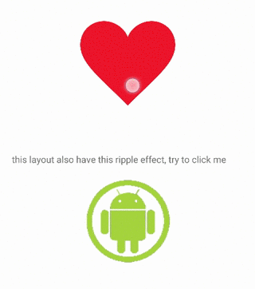

# RippleViews

RippleViews for Android 16+

RippleViews allows you to add the new Android ripple effect in to your views easily and allowing color customization.

## Index
1. [README & Installation & others](#)
2. [RippleButton Widget](docs/RippleButton.md)
3. [RippleImageButton Widget](docs/RippleImageButton.md)
4. [Making views have ripple effect](docs/RippleDrawableHelper.md)
5. [CHANGELOG](CHANGELOG.md)
6. [Last words](docs/Thanks.md)
7. [LICENSE](docs/LICENSE.md)

## What does this library do and what I should care?
Android Lollipop introduces material dessign, that's cool except for one thing, why bother to develop if most of the current smartphones doesn't support and Android have not developed a support library? Because of this same reason, this library allows you a back compatibility to older phones, but at least makes an equivalent behaviour to this versions.

In other words, if in v21 appears a blue circle when you press then in v16 the button will have a blue color when you press, and that is obvious!. But google didn't care about that (thanks Android to become your own Internet Explorer 8). But that's not all, this library doesn't create extra animations and also is not adding a single extra layout to your views, making any loss of perfomance or maintanibility (if you want a button, you use a button, not a layout with an image view and a TextView or something like that). Maybe is not the best solution to the fragmentation problem, but is not my fault trying to help, it's Android's to  meke people like me trying to solve their issues.

## Installation
In your build.gradle file

    dependencies {
        // ...
        compile 'com.xgc1986.android:ripplebutton:0.4.0'
    }

##Live Demo
SOON...

## Usage
minSdkVersion 16 (The ripple effect only works on API >= 21), and I told you why before ;)

[](demo)[](demo)

with xml:
```xml

    <!-- Default -->
    <com.xgc1986.ripplebutton.widget.RippleButton
        android:layout_width="wrap_content"
        android:layout_height="wrap_content"
        android:id="@+id/btn1"
        android:text="Default android button"/>

    <!-- Edited in layout -->
    <com.xgc1986.ripplebutton.widget.RippleButton
        android:layout_width="wrap_content"
        android:layout_height="wrap_content"
        android:id="@+id/btn2"
        android:text="Android button modified in layout"
        app:buttonColor="@android:color/black"
        app:rippleColor="@android:color/white"/>

    <!-- Edited programatically -->
    <com.xgc1986.ripplebutton.widget.RippleButton
        android:layout_width="wrap_content"
        android:layout_height="wrap_content"
        android:id="@+id/btn3"
        android:text="Android button modified programatically"/>
```

with java:
```java

    private int i = 1;

    @Override
    protected void onCreate(Bundle savedInstanceState) {
        super.onCreate(savedInstanceState);
        setContentView(R.layout.activity_main);

	    // Change color programatically
        RippleButton rb = (RippleButton)findViewById(R.id.btn3);
        int buttonColor = getResources().getColor(android.R.color.holo_red_light);
        int rippleColor = getResources().getColor(android.R.color.holo_blue_light);
        rb.setColors(buttonColor, rippleColor);
    }
```

It was easy, check the next part to see more awesome stuff you can do with this library.


Next: [RippleButton Widget](docs/RippleButton.md)


